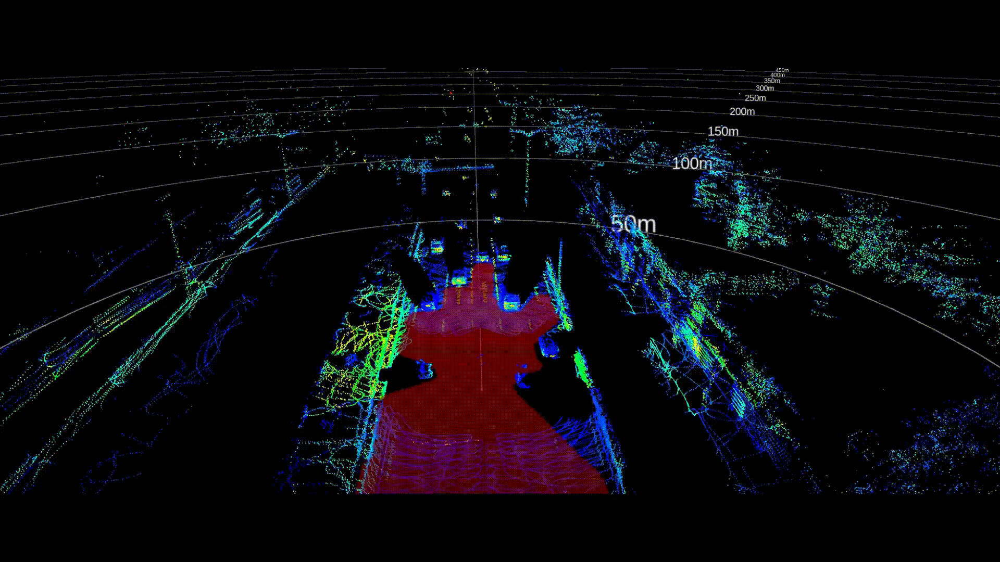

# This is a Port from the official Livox Master branch.
I just quickly swapped all ros1 stuff to ros2 stuff and threw everything into one node and was quite surprised it worked first try.
Maybe there are some bugs or somthing might not be completly correct, but i thought it probably is better than nothing for anyone looking for a ros2 Version.
Feel free to submit any issues or request a merge, if you find something that could be done better.
All the code itself is from the original Livox master, i just replaced all the ros1 with ros2 stuff and fixed all the errors that popped up!

# Patchworkpp
I added patchworkpp to see if it speeds up and improves groundremoval
That way it also skips the internal downsampling and replaces it with a PCL version

# Livox-Free-Space

**Livox-Free-Space** is a fast and effective free-space detection package using [Livox](www.livoxtech.com) LiDAR data. It based on traditional algorithm to segment 3D LiDAR data and generate free-space.

## Demo

<div align="center">

</div>

Free space is marked in red.

## Dependencies

- `ROS` (tested with Melodic)
- `Eigen 3.3.7`
- `PCL 1.8` 

## Installation

```bash
cd ~/your_workspace/src
git clone https://github.com/Livox-SDK/livox_free_space
cd ..
catkin_make
```

## Run with Bag File

- Open your bash and cd to the path of your bag, or you can use the demo bag in data/.
```
rosbag play your.bag
```
- Open another bash and cd to your workspace.
```
cd ~/your_workspace
source devel/setup.bash
roslaunch livox_free_space livox_free_space.launch
```

## Run with your device:
- Run your LiDAR with livox_ros_driver
```
cd ~/catkin_ws
source devel/setup.bash
roslaunch livox_ros_driver livox_lidar.launch
```
- Change the topic name in src/FreeSpace_node.cpp from`/points_raw` to `/livox/lidar`. And then catkin make this package:
```
cd ~/your_workspace
catkin_make
```
- Run the launch file:
```
source devel/setup.bash
roslaunch livox_free_space livox_free_space.launch
```

## Notes

- The required topic name of point cloud messages is `/points_raw`, and the type is `sensor_msgs::PointCloud2`
- The parameter `height_offset` in launch file is used to calibrate the ground height in input point cloud  to near `0` in advance.

## Support
You can get support from Livox with the following methods:
*  Send email to [cs@livoxtech.com](cs@livoxtech.com) with a clear description of your problem and your setup
*  Report issues on github
